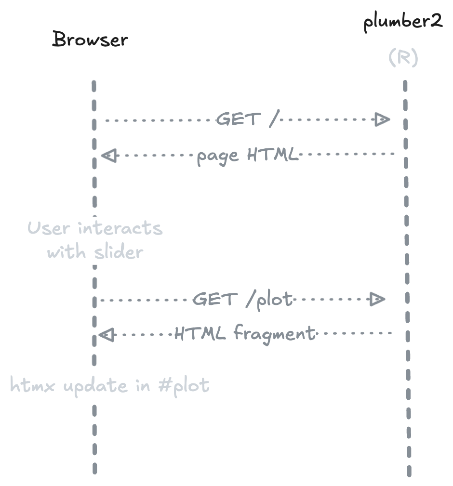
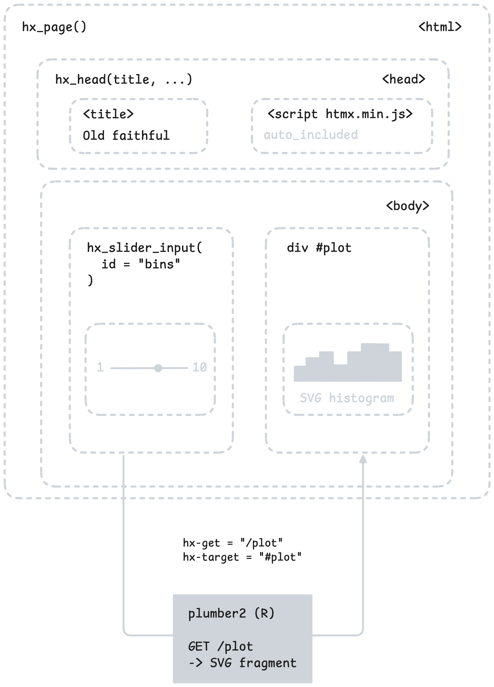

<!-- README.md is generated from README.Rmd. Please edit that file -->

```{r, include = FALSE}
knitr::opts_chunk$set(
  collapse = TRUE,
  comment = "#>",
  fig.path = "man/figures/README-",
  out.width = "100%"
)
```

# htmxr

<!-- badges: start -->
[](https://lifecycle.r-lib.org/articles/stages.html#experimental)
[](https://github.com/hyperverse-r/htmxr/actions/workflows/R-CMD-check.yaml)
<!-- badges: end -->

> Build modern web applications in R — without writing JavaScript.

[htmx](https://htmx.org) handles client-side interactions via HTML attributes.
[plumber2](https://plumber2.posit.co) handles R endpoints server-side.
`{htmxr}` bridges the two with R helpers that generate the right HTML and wire everything together.

## Installation

```r
pak::pak("hyperverse-r/htmxr")
```

## How it works

<p align="center">
  
</p>

On first load, the server returns a complete HTML page. When the user interacts
with an element (e.g. a slider), htmx sends a request to the R endpoint and
swaps the response into the DOM — no JavaScript needed, no full page reload.

## Example — Old Faithful

The `hello` example ships with `{htmxr}`. It reproduces the classic Old Faithful
histogram with a slider to control the number of bins.

### The page

The `GET /` endpoint returns a full HTML page built with `hx_page()` and
`hx_head()`. The slider is created with `hx_slider_input()`, which generates
a `<input type="range">` wired to htmx attributes.

```r
#* @get /
#* @parser none
#* @serializer html
function() {
  hx_page(
    hx_head(title = "Old Faithful Geyser Data", bootstrap_css),
    tags$div(
      class = "container py-5",
      # ...
      hx_slider_input(
        id = "bins",
        label = "Number of bins:",
        value = 30,
        min = 1,
        max = 50,
        get = "/plot",
        trigger = "input changed delay:300ms",
        target = "#plot"
      )
      # ...
    )
  )
}
```

### The endpoint

The `GET /plot` endpoint is a standard plumber2 handler. It receives the `bins`
query parameter, generates an SVG histogram, and returns it as an HTML fragment.

```r
generate_plot <- function(bins = 30) {
  svg_string <- svglite::xmlSVG({
    x <- faithful[, 2]
    bins_seq <- seq(min(x), max(x), length.out = as.numeric(bins) + 1)
    hist(x, breaks = bins_seq, col = "darkgray", border = "white")
  })
  svg_string
}

#* @get /plot
#* @query bins:integer(30)
#* @parser none
#* @serializer none
function(query) {
  generate_plot(query$bins)
}
```

<p align="center">
  
</p>


### Run it

```r
hx_run_example("hello")
```


## Design philosophy

`{htmxr}` is built around a few explicit constraints:

- **Primitives, not a framework** — `{htmxr}` provides low-level building blocks.
  It doesn't impose a page structure, a routing convention, or an application model.
  You compose your own app from small, predictable pieces.

- **HTML over abstraction** — Every `hx_*` function produces standard HTML elements
  with `hx-*` attributes. There is no hidden layer, no reactivity graph, no virtual DOM.
  What you write in R is what lands in the browser.

- **CSS-agnostic** — `{htmxr}` doesn't depend on any CSS framework.
  Use Bootstrap, Tailwind, plain CSS, or nothing at all.

- **R-centric** — All logic lives in R. htmx handles client-side interactions via
  HTML attributes — no JavaScript required in your application code.

- **htmltools re-exported** — `tags`, `div`, `p`, etc. are available directly from
  `{htmxr}`, so you don't need to load `{htmltools}` separately.
